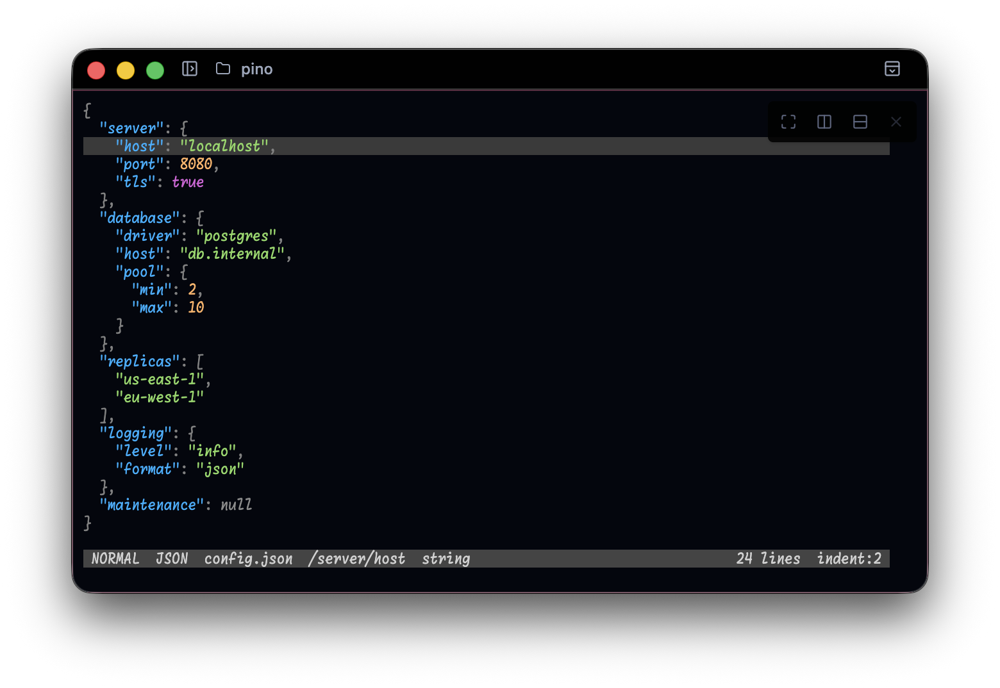
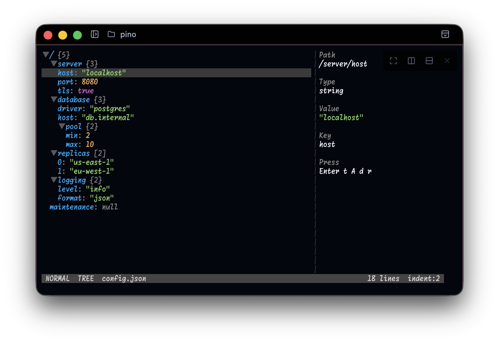

# Pino

An interactive terminal editor for JSON files.

| JSON View                                                             | Tree View                                                                    |
| --------------------------------------------------------------------- | ---------------------------------------------------------------------------- |
|  |  |

## Features

- Navigate and edit a JSON document by its structure instead of manipulating its
  syntax by hand.
- Switch between formatted JSON and tree views without losing the selected node.
- Add, delete, rename, and change the type of values, with undo and redo.
- Preserve the detected indentation and newline style when saving.

## Install

Choose a version from the
[Releases](https://github.com/ytakahashi/pino/releases) page, then replace every
`{version}` (e.g. `v0.1.0`) below with its tag.

The commands install the macOS build for Apple silicon:

```sh
curl -sSfL https://github.com/ytakahashi/pino/releases/download/{version}/pino_{version}_darwin_arm64.tar.gz | tar -xz
install -m 0755 pino /usr/local/bin/pino # or somewhere under $PATH
```

For another supported platform, use the same commands after replacing
`darwin_arm64` in the download URL:

| Platform               | Replacement    |
| ---------------------- | -------------- |
| macOS on Apple silicon | `darwin_arm64` |
| Linux on x86-64        | `linux_amd64`  |
| Linux on ARM64         | `linux_arm64`  |

If you have Go 1.26.5 or later, you can install pino from source instead:

```sh
go install github.com/ytakahashi/pino/cmd/pino@latest
```

## Getting started

Open one JSON file:

```sh
pino path/to/file.json
```

The keys below cover a first editing session. Press `?` inside pino to see all
available keys.

| Key            | Action                          |
| -------------- | ------------------------------- |
| `j` / `↓`      | Move to the next node           |
| `k` / `↑`      | Move to the previous node       |
| `h` / `←`      | Move out to the parent          |
| `l` / `→`      | Move into a container           |
| `Enter`        | Edit a value or fold a node     |
| `Tab`          | Switch between views            |
| `Ctrl+s`       | Save                            |
| `q` / `Ctrl+c` | Quit                            |
| `?`            | Show the complete key reference |

## Views

JSON View presents the document as formatted JSON. Tree View presents the same
document as a compact hierarchy with details about the selected node. Press
`Tab` to switch views; the same node remains selected.

## Options

```text
usage: pino [options] <file> [options]
```

| Option               | Description                                                |
| -------------------- | ---------------------------------------------------------- |
| `-h`, `--help`       | print help information and exit                            |
| `-i`, `--indent int` | indentation width, overriding the one detected in the file |
| `-v`, `--version`    | print version information and exit                         |
